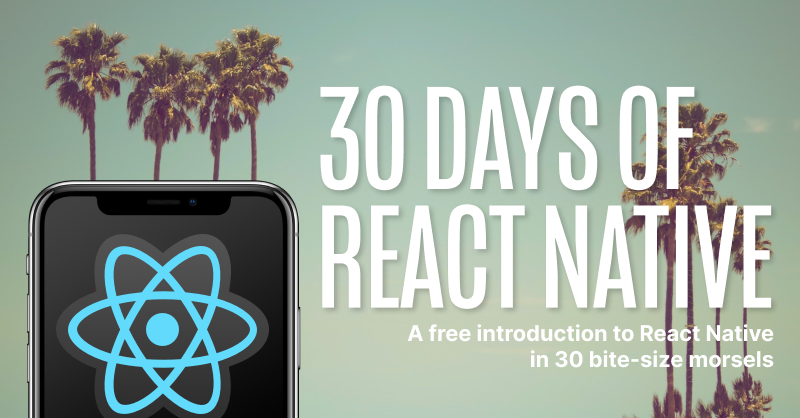
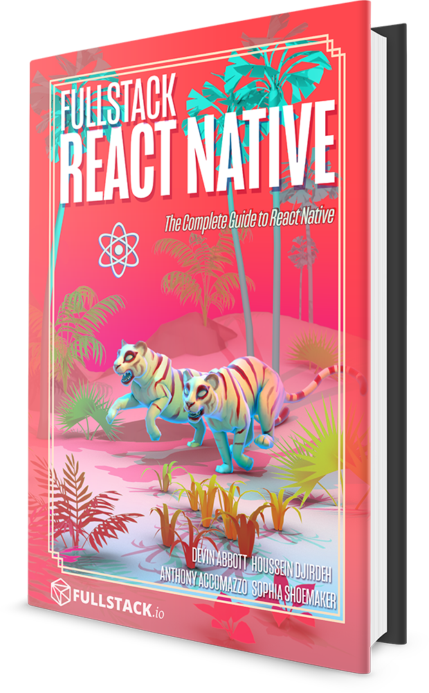

<p align="center">
  
</p>
<h3 align="center">
  ✨ 30 Days of React Native ✨
</h3>
<p align="center">
  An Introduction to React Native - in 30 Bite-Size Morsels. Written by the authors of <a href="https://www.fullstackreact.com/react-native/">Fullstack React Native</a></a>
</p>

# 🚀 Introduction

Over the next 30 days, we'll walk through everything you need to know to work with React Native. From the very beginning through topics like the **navigation**, **animation** and even **native modules**.

This repository contains the entire source and content for the article series of [30 Days of React Native](https://www.fullstack.io/30-days-of-react-native) hosted by the [Fullstack React Native](https://www.fullstackreact.com/react-native/) team.

## 👀 What's inside?

<!-- prettier-ignore -->
|  <a align='center' href='./day-01'></a><h4 align='center'><a href='./day-01'>What is React Native?</a><h4> | <a href='./day-02'></a><h4 align='center'><a href='./day-02'>Getting Started</a><h4> | <a href='./day-03'></a><h4 align='center'><a href='./day-03'>First Component</a><h4> | <a href='./day-04'></a><h4 align='center'><a href='./day-04'>Styles</a><h4> | <a href='./day-05'></a><h4 align='center'><a href='./day-05'>Layout with Flexbox</a><h4>  |
|:-:|:-:|---|---|---|
|  <a href='./day-06'></a><h4 align='center'><a href='./day-06'>Text Components</a><h4> | | | | |

## 👩‍🏫 How to use this repository

Most days contain interactive code samples embedded in [Expo Snack](https://snack.expo.io/). Expo Snack is a free service for previewing React Native apps right in your browser, similar to Codesandbox or Codepen, but designed specifically for React Native.

However if you'd like, you can run any code sample on your computer by first downloading it (we've included a download link below each code sample), unzipping it, navigating to that directory in the terminal, and then running:

```bash
npm install

expo start
```

Some days have special instructions, e.g. how to set up a new React Native project from scratch, in which case you should follow the instructions listed for that day.

## Contributors

<!-- To update this contributors list, run `npx all-contributors-cli` -->

<!-- ALL-CONTRIBUTORS-LIST:START - Do not remove or modify this section -->
<!-- prettier-ignore-start -->
<!-- markdownlint-disable -->
<table>
  <tr>
    <td align="center"><a href='https://twitter.com/dvnabbott'><h4 align='center'><a href='https://twitter.com/dvnabbott'>Devin Abbott</a></h4></td>
    <td align="center"><a href='https://twitter.com/hdjirdeh'><h4 align='center'><a href='https://twitter.com/hdjirdeh'>Houssein Djirdeh</a></h4></td>
    <td align="center"><a href='https://twitter.com/accomazzo'><h4 align='center'><a href='https://twitter.com/accomazzo'>Accomazzo Anthony</a></h4></td>
  </tr>
</table>

<!-- markdownlint-enable -->
<!-- prettier-ignore-end -->

<!-- ALL-CONTRIBUTORS-LIST:END -->

# Fullstack React Native Book

<a href="https://www.fullstackreact.com/react-native/">
  
</a>

This repo was written and is maintained by the [Fullstack React Native](https://www.fullstackreact.com/react-native/) team. In the book we cover many more projects like this. We walk through each line of code, explain why it's there and how it works.

_30 Days of React Native_ covers only the early basics of React Native. If you're looking to learn how to build real-world React Native apps, including libraries from the React Native ecosystem, there's no faster way than by spending a few hours with the Fullstack React Native book.
